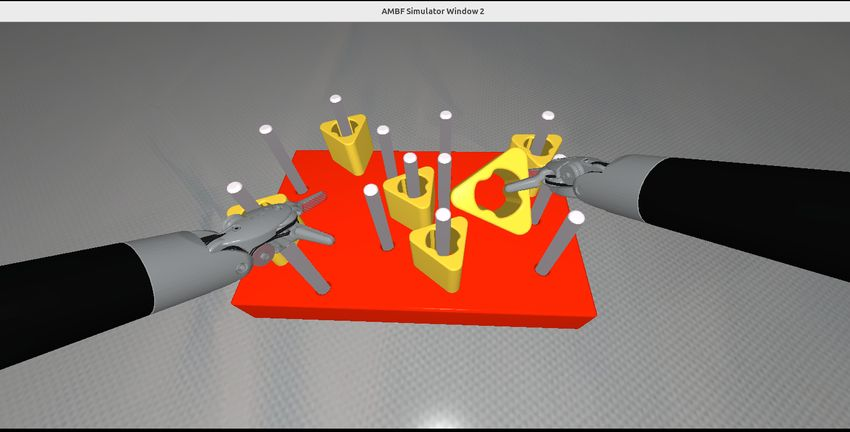

## AMBF Simulation Setup

The [Asynchronous Multi-Body Framework (AMBF)](https://github.com/WPI-AIM/ambf)
simulator, Version 3.0, along with the
[Surgical Robotics Challenge Assets](https://github.com/surgical-robotics-ai/surgical_robotics_challenge), icra2026-challenge branch,
will be installed on the AMBF Simulation PC in the competition area..

The simulation environment will be similar to the one below. There will be two da Vinci large needle drivers and a pegboard with posts on either side of a large wall. There will be three pegs, each with a different color.

The virtual stereo camera emulates the OAK-D-SR camera used in [Physical dVRK setup](./dvrk-setup.html). In particular, the stereo baseline is 20 mm, the FOV is 80 deg (H), 55 deg (V), and the resolution is 1280 x 800.

## Human Teleoperation Peg Transfer Challenge

No preparation is necessary -- please come to the competition area and give it a try!

You will use a Quest 3 HMD, with hand controllers, as the interface to control the simulated PSMs.

## Autonomous Peg Transfer Challenge

Competitors for the Autonomous Peg Transfer Challenge should consider one or more of the following options:

### Option 1: Run your algorithm on your own computer

Your computer should be running ROS2 Jazzy(?) and can interface to the AMBF simulation computer via a local area connection.

### Option 2: Run your algorithm on the AMBF Simulation computer

We will create a separate login account for your team, using the account name requested on the registration form.

Following are the specifications for the AMBF Simulation computer: TBD

In addition to ROS2, AMBF, and the Surgical Robotics Challenge Assets, the following packages will be installed: TBD

## Offline Development and Testing

If you wish to create the AMBF simulation environment on your own computer, please follow the detailed instructions
[here](https://github.com/surgical-robotics-ai/surgical_robotics_challenge/blob/icra2026-challenge/README.md)

We recommend using ROS2 on Ubuntu 24.04.
