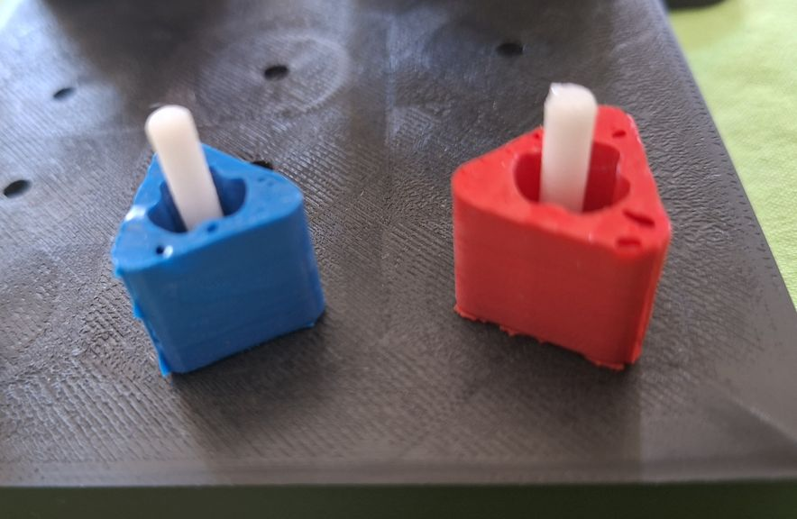
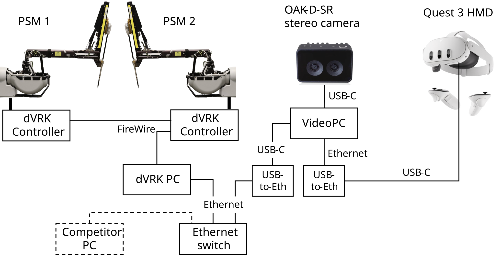
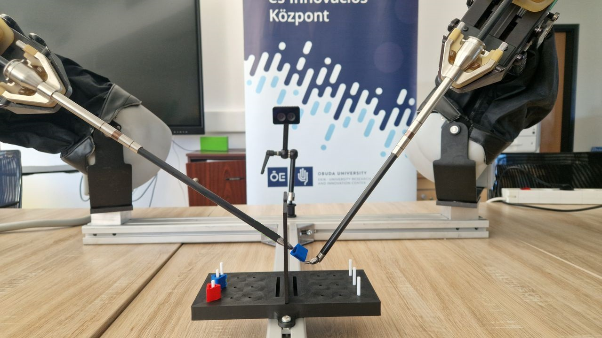

## Physical dVRK Setup

There are two PSMs from the first-generation [da Vinci Research Kit (dVRK)](https://dvrk.readthedocs.io/main/), mounted on a fixed frame. A large needle driver (LND) is installed in each PSM. We are using a fixed stereo camera (OAK-D-SR) to emulate a modern clinical endoscope (which has better image quality than the standard dVRK endoscope). A pegboard with pegs is positioned between the two PSMs. There is one blue peg and one red peg, as shown in the image below:

The physical setup uses two computers:  (1) dVRK PC, connected to the dVRK controllers via FireWire, and (2) Video PC, connected to the stereo camera and Quest 3 (for human teleoperation trials). The two computers are connected together via a local network. A block diagram of the system is shown below (yes, we are aware that it looks strange to use two USB-to-Ethernet adapters, but there are some technical reasons for this).

Following is a photo of the Physical dVRK setup (from Obuda University):

## Human Teleoperation Peg Transfer Challenge

No preparation is necessary -- please come to the competition area and give it a try!

You will use a Quest 3 HMD, with hand controllers, as the interface to control the physical PSMs.

## Autonomous Peg Transfer Challenge

Competitors for the Autonomous Peg Transfer Challenge should develop algorithms that interface
with the dVRK and stereo camera, via the [ROS2 API](./ros2-api.html), using one of the following options:

### Option 1: Run your algorithm on your own computer

Your computer should be running ROS2 Jazzy and can interface to the Video PC via a local area connection (wired Ethernet).

### Option 2: Run your algorithm on the Video PC

We will create a separate login account for your team, using the account name requested on the registration form.

Following are the specifications for the Video PC (HP ZBook):

| CPU | Intel Core Ultra 7 256HX, 2600 Mhz, 20 Cores |
| GPU | NVIDIA RTX PRO 1000, 8GB     |
| RAM | 32GB                         |

Packages installed: ROS2

## Video Specifications

The physical setup uses an OAK-D-SR stereo camera instead of an endoscope. Specifications are available [here](https://shop.luxonis.com/products/oak-d-sr). Key specifications include the following:

* Stereo baseline:  20 mm
* FOV: 80 deg (H), 55 deg (V)
* Resolution:  1280 x 800

Interface to the stereo video stream is provided through ROS topics.

Although this camera can provide depth estimates using its onboard processing, this feature is not be available for the competition to preserve some similarity to a clinical endoscope. However, competitors are allowed to implement their own depth estimation using the stereo images.
